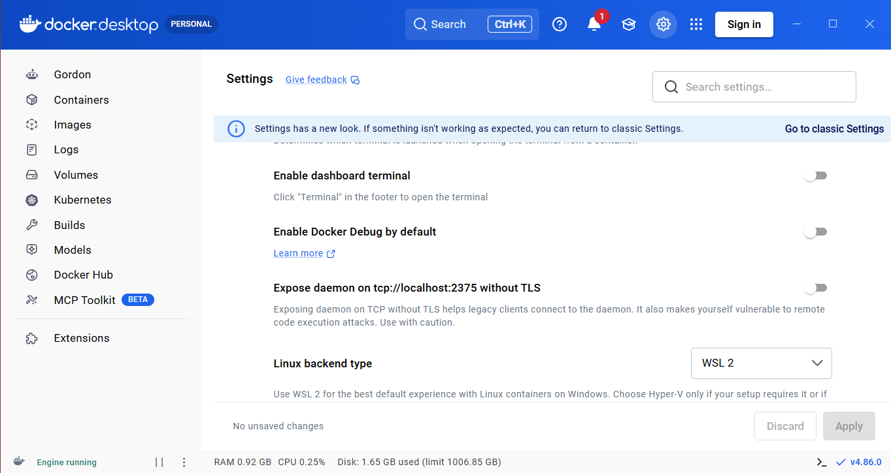
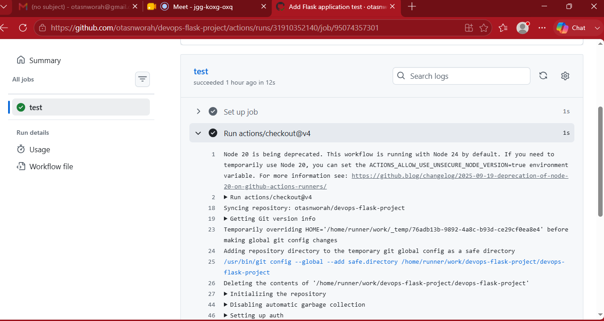
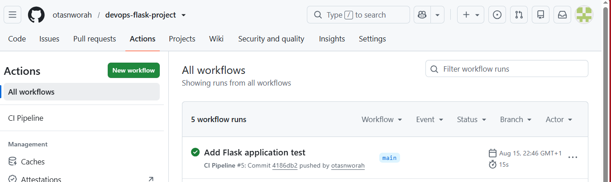
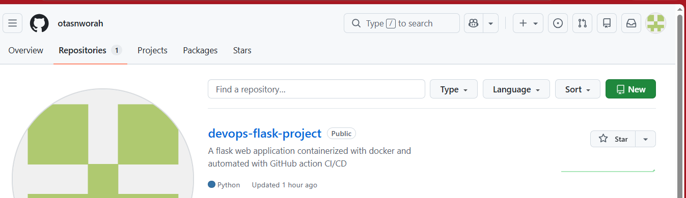

# Automated CI Pipeline for a Flask Application

## 🚀 Project Overview

This project demonstrates the implementation of an automated Continuous Integration (CI) pipeline for a Python Flask application.

The pipeline uses GitHub Actions to automatically install dependencies and run automated tests whenever code is pushed to the GitHub repository.

The application is also containerized using Docker, demonstrating practical knowledge of application containerization and CI automation.

---

## 🎯 Project Objective

The objective of this project is to automate the testing process of a Flask application so that every code change can be automatically validated before being considered ready.

Instead of manually testing the application after every change, GitHub Actions automatically performs the testing process.

---

## 🛠️ Technologies Used

- Python
- Flask
- Pytest
- Docker
- Git
- GitHub
- GitHub Actions
- Linux / WSL
- YAML

---

## 🏗️ Project Architecture

```text
Developer
|
| Git Push
↓
GitHub Repository
|
↓
GitHub Actions
|
┌───────┴────────┐
↓ ↓
Checkout Code Set Up Python
| |
└───────┬────────┘
↓
Install Dependencies
|
↓
Run Pytest
|
┌───────┴────────┐
↓ ↓
Passed Failed
| |
↓ ↓
✅ Green Build ❌ Build Failed⚙️ How the CI Pipeline Works
The developer makes changes to the Flask application.
The code is committed using Git.
The code is pushed to the GitHub repository.
GitHub Actions automatically detects the push.
A new CI workflow starts on an Ubuntu runner.
The repository code is checked out.
Python 3.12 is configured.
Dependencies are installed from requirements.txt.
Pytest runs the automated tests.
GitHub Actions reports the result.
If the test passes, the pipeline displays a green checkmark.
If the test fails, the pipeline reports the error.Project Structure
devops-flask-project/
│
├── app.py
├── test_app.py
├── Dockerfile
├── requirements.txt
├── .dockerignore
├── README.md
│
├── screenshots/
│ ├── docker-running.png
│ ├── pytest-passed.png
│ ├── github-actions-success.png
│ └── github-repository.png
│
└── .github/
└── workflows/
└── ci.yml🐍 Flask Application
The project contains a simple Flask web application.
The application can be run locally using:
python3 app.py
The application provides a web endpoint that can be tested automatically using Pytest.🧪 Automated Testing
Pytest is used to automatically test the Flask application.
The project contains a test file:
test_app.py
The test verifies that the application's home route responds successfully.
To run the tests locally:
pytest
Successful test result:
1 passed🐳 Docker Containerization
The Flask application is packaged into a Docker container.
Docker provides a consistent environment for running the application and makes the application easier to deploy.
Build the Docker image
docker build -t devops-flask-app .
Run the container
docker run -d -p 5000:5000 devops-flask-app
Check running containers
docker psGitHub Actions Workflow
The CI workflow is located at:
.github/workflows/ci.yml
The workflow is triggered when code is pushed to GitHub or when a pull request is created.
The workflow performs these steps:
Checkout Code
↓
Set Up Python
↓
Install Dependencies
↓
Run Pytest
↓
Test Result
↓
✅ Successful Build📸 Project Screenshots
1. Docker Container Running
This screenshot shows the Flask application running inside a Docker container.
�
2. Automated Tests Passing
This screenshot shows the automated Pytest test successfully passing locally.
�
3. GitHub Actions CI Pipeline
This screenshot shows the GitHub Actions workflow completing successfully with a green status.
�
4. GitHub Repository
This screenshot shows the project files and structure inside the GitHub repository.
�✅ CI Pipeline Result
The CI pipeline successfully:
Checks out the source code
Sets up Python
Installs project dependencies
Runs automated tests
Reports the test result
The pipeline currently completes successfully with a green status when the tests pass.🔐 DevOps Concepts Demonstrated
This project demonstrates practical experience with:
Continuous Integration (CI)
Git version control
GitHub repositories
GitHub Actions
YAML workflow configuration
Automated testing
Python virtual environments
Flask
Docker containerization
Linux command-line operations
CI troubleshooting
DevOps automatio💡 Problems Encountered and Solutions
GitHub Authentication
GitHub no longer accepts account passwords for Git operations over HTTPS.
Solution: A GitHub Personal Access Token was used for authentication.
GitHub Actions YAML Error
The initial workflow contained incorrect YAML indentation.
Solution: The workflow was corrected and tested until GitHub Actions successfully recognized the configuration.
Missing Pytest Dependency
The CI pipeline initially failed because Pytest was not included in the project dependencies.
Solution: Pytest was added to requirements.txt.
No Tests Found
The pipeline then reported:
collected 0 itemsSolution: An automated Flask test was created in test_app.py.
Test Indentation Error
The test initially contained an indentation error.
Solution: The Python test was corrected and verified locally with Pytest.
Final result:
1 passed📚 What I Learned
Through this project, I gained practical experience with:
Creating a Git repository
Managing source code with Git
Working with GitHub
Creating GitHub Actions workflows
Writing YAML configuration
Creating automated tests
Troubleshooting CI pipeline failures
Using Python virtual environments
Containerizing applications with Docker
Understanding the Continuous Integration workflow🚀 Future Improvements
Possible improvements include:
Add more automated tests
Add code quality checks
Add security scanning
Automatically build the Docker image in GitHub Actions
Push Docker images to a container registry
Add Continuous Deployment (CD)
Deploy the application to AWS
Add application monitoring👤 Author
Otas Nworah
DevOps & Cloud Computing Engineer⭐ Project Outcome
This project demonstrates how a developer can move from writing application code to automatically testing that code through a CI pipeline.
Code → GitHub → GitHub Actions → Automated Tests → ✅ Successful Build
## 📸 Project Screenshots

### 1. Docker Container Running



### 2. Automated Tests Passing



### 3. GitHub Actions CI Pipeline



### 4. GitHub Repository


